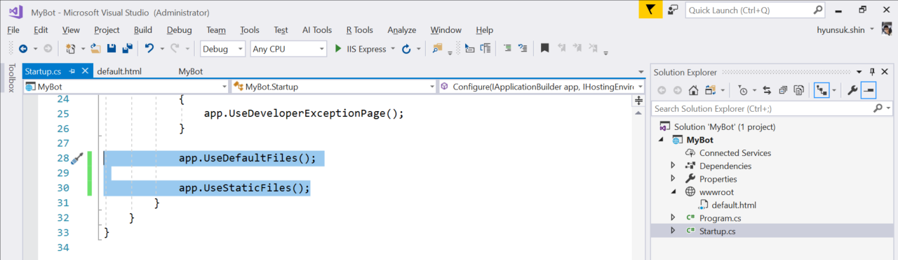

# 1. Create and Deploy a Bot 

## 1.1 Plan

Let's __Plan__ a bot that repeating what uers said

## 2. Build

### 2.1 Create project

To build the bot we will use Visual Studio 2017

Create a project with the 'ASP.NET Core Web Application' templage


Select __Empty__ project template


__Add__ new item


Add new item with HTML Page tempate and use following name

```
default.html
```


Update the code with following sample

```html
<!DOCTYPE html>
<html>
    <head>
        <meta charset="utf-8" />
        <title>Your Bot Name Here</title>
    </head>
    <body>
        <p>
        <p>Welcome to your Bot.</p>
        <p>You can access your bot locally via 
<pre><b>http://localhost:your port/api/messages</b></pre></p>
        </p>
    </body>
</html>
```


Open __Startup.cs__ and remove multiple lines 28 to 31


Add following codes to at the line 28 in __Startup.cs__ file

```C#
app.UseDefaultFiles();

app.UseStaticFiles();
```



Save your work and Press F5 to complie and start a debug session

### 2.2 Add NuGet Packages

Open __Manage NuGet Packages__ window


Search and install a package with following name

```
Microsoft.Bot.Builder.Integration.AspNet.Core
```


Add a new class that will have logics of Bot


Add a calss that has the name 'MyBot'


Open MyBot.cs file and add folling codes top of the code

```C#
using Microsoft.Bot;
using Microsoft.Bot.Builder;
using Microsoft.Bot.Schema;
using System.Threading;
using System.Threading.Tasks;
```

Update the class to use IBot interface and it's method

```C#
public class MyBot : IBot
{
    public async Task OnTurnAsync(ITurnContext turnContext, CancellationToken cancellationToken = default(CancellationToken))
    {
        throw new System.NotImplementedException();
    }

}
```


Open __Startup.cs__ file to add following system libraries

```C#
using Microsoft.AspNetCore.Builder;
using Microsoft.AspNetCore.Hosting;
using Microsoft.Bot.Builder.BotFramework;
using Microsoft.Bot.Builder.Integration.AspNet.Core;
using Microsoft.Extensions.Configuration;
using Microsoft.Extensions.DependencyInjection;
```


Add configuration variable and Startup method

```C#
private IConfiguration configuration;
```

```C#
public Startup(IHostingEnvironment env)
{
    var builder = new ConfigurationBuilder()
    .SetBasePath(env.ContentRootPath)
    .AddJsonFile("appsettings.json", optional: true, reloadOnChange: true)
    .AddJsonFile($"appsettings.{env.EnvironmentName}.json", optional: true)
    .AddEnvironmentVariables();
    configuration = builder.Build();
}
```


Add new configurations and options at __CongifureServices__ method

```C#
services.AddSingleton(configuration);
services.AddBot<MyBot>(options =>
{
    options.CredentialProvider = new ConfigurationCredentialProvider(configuration);
});
```

Add following to __Startup.cs__

```C#
app.UseBotFramework();
```


Replace the thorw statement to somthing meaningful, like following

```C#
if (turnContext.Activity.Type is ActivityTypes.Message)
{
    string userInput = turnContext.Activity.Text;
    await turnContext.SendActivityAsync($"You wrote {userInput}");
}
```


### 3. Test

### 3.1 Run the app as debug mode 

Save your work and Press F5 to complie and start a debug session

### 3.2 Test the app using Bot Framework Emulator

Once you see default web page, execute __Bot Framework Emulator__

Create new bot configuration __File__ |  __New Bot Configuration__


Type something to see the response from the Bot


### 4. Publish

Publish the Bot to Azure


### 4.1 Use publish wizard

Select __Create New__ as there is no web app


Fill out the form to create a web app


### 4.2 Create a Bot Channels Registration from Azure Portal

Open [Azure Portal](https://portal.azure.com) and Create new __Bot Channels Registration__ form the portal


Fill out the form and create the service


Make sure that selection for Microsoft App ID and password that Bot will use later 


### 4.3 Get and update credentials for Bot

Get the Microsoft App ID and Password from App Registration Management portal

Find management portal link from __Settings__ 


Generate and copy new password form the portal safe and also copy Application ID


Update the ID and Password to Web App | Settings | Application Settings

Use following names for App Setting Name

|App Setting Name|
|---|
|MicrosoftAppId|
|MicrosoftAppPassword|


### 4.4 Test Bot

Use Test in Web Chat in the Bot management feature in Bot Channels Registration

