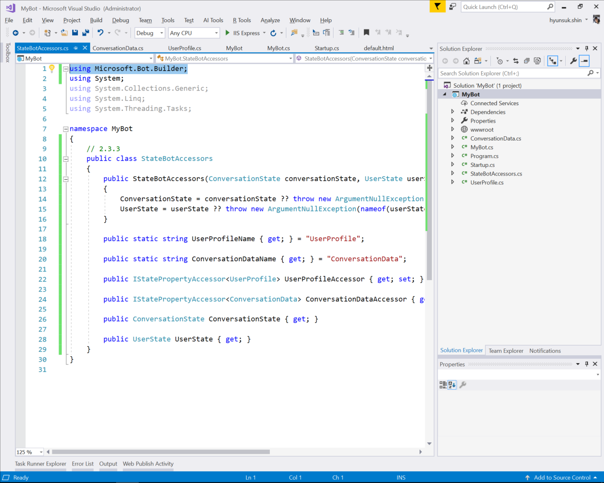
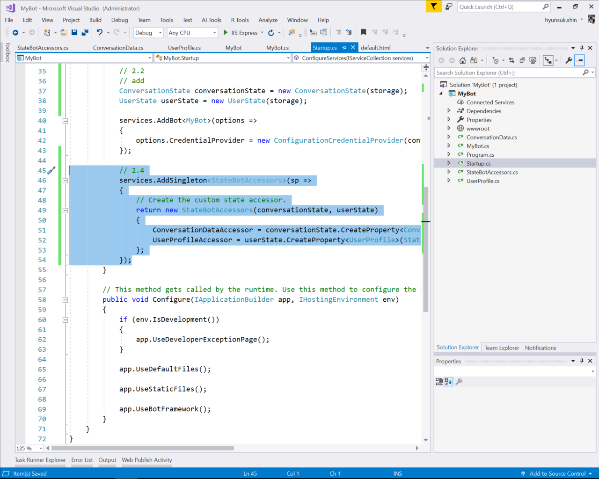
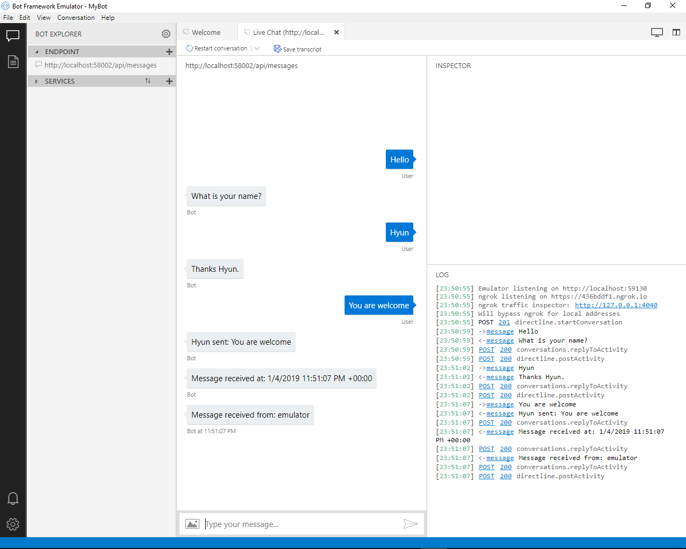

# 2. Manage State

> Use Bot Builder SDK v4

## 2.1 Configure Storage

Configure the storage layer in __Startup.cs__ file

Add following code __ConfigureServcies__ method in Startup.cs file

```C#
// ...
IStorage storage = new MemoryStorage();
// ...
```

## 2.2 Create state management objects

```C#
public void ConfigureServices(IServiceCollection services)
{
    // ...
    ConversationState conversationState = new ConversationState(storage);
    UserState userState = new UserState(storage);
    // ...
}
```

## 2.3 Create State Property Accessors

Define classes to contain all the information that we want to manage in each type of state

A __UserProfile__ class for the user information that the bot will collect

```C#
public class UserProfile
{
    //2.3
    public string Name { get; set; }
}
```

A ConversationData class to track information about when a message arrived and who sent the message

```C#
// Defines a state property used to track conversation data.
public class ConversationData
{
    // The time-stamp of the most recent incoming message.
    public string Timestamp { get; set; }

    // The ID of the user's channel.
    public string ChannelId { get; set; }

    // Track whether we have already asked the user's name
    public bool PromptedUserForName { get; set; } = false;
}
```

Next, we define a class that contains the state management information we'll need to configure our bot instance

```C#
public class StateBotAccessors
{
    public StateBotAccessors(ConversationState conversationState, UserState userState)
    {
        ConversationState = conversationState ?? throw new ArgumentNullException(nameof(conversationState));
        UserState = userState ?? throw new ArgumentNullException(nameof(userState));
    }
  
    public static string UserProfileName { get; } = "UserProfile";

    public static string ConversationDataName { get; } = "ConversationData";

    public IStatePropertyAccessor<UserProfile> UserProfileAccessor { get; set; }

    public IStatePropertyAccessor<ConversationData> ConversationDataAccessor { get; set; }
  
    public ConversationState ConversationState { get; }
  
    public UserState UserState { get; }
}
```



## 2.4 Configure your bot

In Startup.cs, we configure ASP.NET to provide the bundled state property and management objects. This will be retrieved from the bot's constructor through the dependency injection framework in ASP.NET Core

```C#
public void ConfigureServices(IServiceCollection services)
{
    // ...
    services.AddSingleton<StateBotAccessors>(sp =>
    {
        // Create the custom state accessor.
        return new StateBotAccessors(conversationState, userState)
        {
            ConversationDataAccessor = conversationState.CreateProperty<ConversationData>(StateBotAccessors.ConversationDataName),
            UserProfileAccessor = userState.CreateProperty<UserProfile>(StateBotAccessors.UserProfileName),
        };
    });
}
```



In the bot's constructor, the CustomPromptBotAccessors object is provided when ASP.NET creates the bot

```C#
// Defines a bot for filling a user profile.
public class CustomPromptBot : IBot
{
    private readonly StateBotAccessors _accessors;

    public MyBot(StateBotAccessors accessors, ILoggerFactory loggerFactory)
    {
        // ...
        _accessors = accessors ?? throw new System.ArgumentNullException(nameof(accessors));
    }

    // The bot's turn handler and other supporting code...
}
```

## 2.5 Access state from your bot

The preceding sections cover the initialization-time steps to add our state property accessors to our bot. Now, we can use those accessors at run-time to read and write state information.

* Before we use our state properties, we use each accessor to load the property from storage and get it from the state cache
    * Whenever you get a state property via its accessor, you should provide a default value. Otherwise, you can get a null value error

* Before we exit the turn handler: 
    * We use the accessors' set method to push changes to the bot state.
    * We use the state management objects' save changes method to write those changes to storage.

```C#
// The bot's turn handler.
public async Task OnTurnAsync(ITurnContext turnContext, CancellationToken cancellationToken = default(CancellationToken))
{
    if (turnContext.Activity.Type == ActivityTypes.Message)
    {
        // Get the state properties from the turn context.
        UserProfile userProfile =
            await _accessors.UserProfileAccessor.GetAsync(turnContext, () => new UserProfile());
        ConversationData conversationData =
            await _accessors.ConversationDataAccessor.GetAsync(turnContext, () => new ConversationData());

        if (string.IsNullOrEmpty(userProfile.Name))
        {
            // First time around this is set to false, so we will prompt user for name.
            if (conversationData.PromptedUserForName)
            {
                // Set the name to what the user provided
                userProfile.Name = turnContext.Activity.Text?.Trim();

                // Acknowledge that we got their name.
                await turnContext.SendActivityAsync($"Thanks {userProfile.Name}.");

                // Reset the flag to allow the bot to go though the cycle again.
                conversationData.PromptedUserForName = false;
            }
            else
            {
                // Prompt the user for their name.
                await turnContext.SendActivityAsync($"What is your name?");

                // Set the flag to true, so we don't prompt in the next turn.
                conversationData.PromptedUserForName = true;
            }

            // Save user state and save changes.
            await _accessors.UserProfileAccessor.SetAsync(turnContext, userProfile);
            await _accessors.UserState.SaveChangesAsync(turnContext);
        }
        else
        {
            // Add message details to the conversation data.
            conversationData.Timestamp = turnContext.Activity.Timestamp.ToString();
            conversationData.ChannelId = turnContext.Activity.ChannelId.ToString();

            // Display state data
            await turnContext.SendActivityAsync($"{userProfile.Name} sent: {turnContext.Activity.Text}");
            await turnContext.SendActivityAsync($"Message received at: {conversationData.Timestamp}");
            await turnContext.SendActivityAsync($"Message received from: {conversationData.ChannelId}");
        }

        // Update conversation state and save changes.
        await _accessors.ConversationDataAccessor.SetAsync(turnContext, conversationData);
        await _accessors.ConversationState.SaveChangesAsync(turnContext);
    }
}
```

### 2.6 Test your bot

Run the app locally on the Virtual Machine 

Use the emulator to test the bot



---

[Next 03. Prompt User Input](./03.PromptUserInput.md)