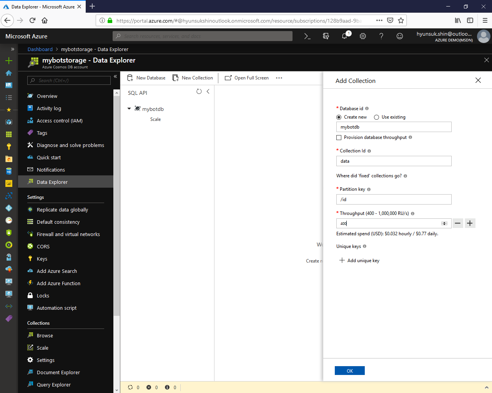
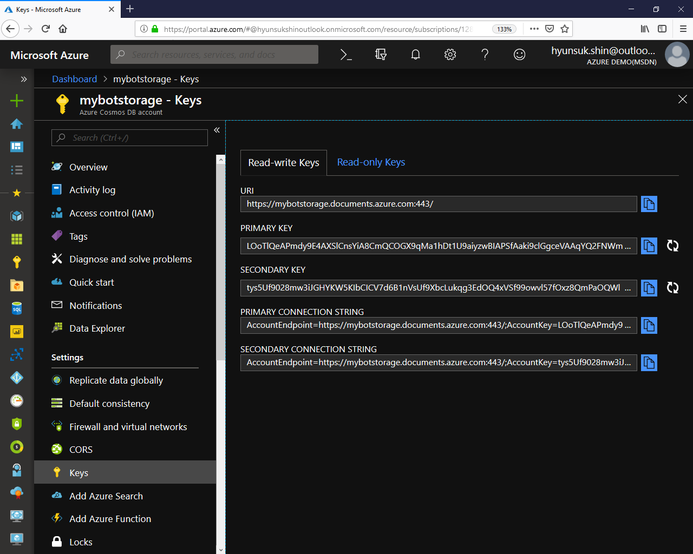
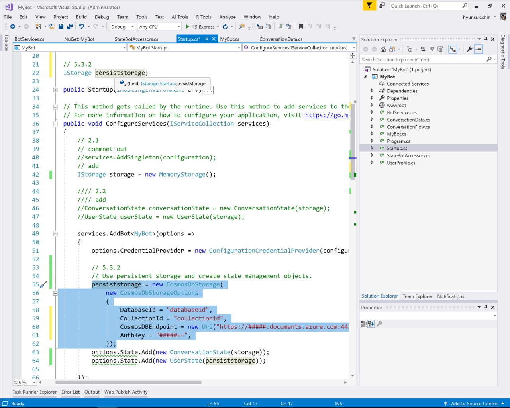

# 5. Persis Data

## 5.1 Add NuGet packet

Search and add __Microsoft.Bot.Builder.Azure__ from NuGet packet manager


### 5.2 Create a CosmosDB service

Create new Azure CosmosDB:

To set up a CosmosDB service and a database, follow the instructions for using CosmosDB. The steps are summarized here:

1. In a new browser window, sign in to the [Azure portal](https://portal.azure.com).

1. Click Create a resource > Databases > Azure Cosmos DB.

1. In the New account page, provide a unique name in the ID field. For API, select __SQL__, and provide Subscription, Location, and Resource group information.

1. Click Create.

Then, add a collection to that service for use with this bot.

Record the database ID and collection ID you used to add the collection, and also the URI and primary key from the collection's keys settings, as we will need these to connect our bot to the service.

|Name|value|
|---|---|
|database ID||
|Collection ID||



### 5.3 Update application setting for CosmosDB

Get following information from Azure CosmosDB settings and take the note of it

|Name|Value|
|---|---|
|URI||
|Primary Key||



### 5.4 Update the startup.cs code for your bot

```C#
using System;
using System.Linq;
using Microsoft.AspNetCore.Builder;
using Microsoft.AspNetCore.Hosting;
using Microsoft.Bot.Builder;
using Microsoft.Bot.Builder.Azure;
using Microsoft.Bot.Builder.Dialogs;
using Microsoft.Bot.Builder.Integration;
using Microsoft.Bot.Builder.Integration.AspNet.Core;
using Microsoft.Bot.Configuration;
using Microsoft.Bot.Connector.Authentication;
using Microsoft.Extensions.Configuration;
using Microsoft.Extensions.DependencyInjection;
using Microsoft.Extensions.Logging;
using Microsoft.Extensions.Options;
```

In your __ConfigureServices__ method, update the add bot call, starting from where you create the backing storage object, and then register your bot accessors object.

We need conversation state for the __DialogState__ object to track the dialog state. We're registering singletons for the dialog state property accessor and the dialog set that our bot will use. The bot will create its own state property accessor for the user state.

```C#
        //...
        // 5.3.2
        IStorage persiststorage;
        //...
        
        public void ConfigureServices(IServiceCollection services)
        {
            //...
            services.AddBot<MyBot>(options =>
            {
                options.CredentialProvider = new ConfigurationCredentialProvider(configuration);
                
                // 5.3.2
                // Use persistent storage and create state management objects.
                persiststorage = new CosmosDbStorage(
                    new CosmosDbStorageOptions
                    {
                        DatabaseId = "updatehere",
                        CollectionId = "updatehere",
                        CosmosDBEndpoint = new Uri("https://updatehere.documents.azure.com:443/"),
                        AuthKey = "updatehere",
                    });
                options.State.Add(new ConversationState(storage));
                options.State.Add(new UserState(persiststorage));

            });
        }
```



When it comes time to save user data, you have some choices. The SDK provides a few state objects with different scopes that you can choose from. Here, we're using conversation state to manage the dialog state object and user state to manage user data.

---

[Next 06. Welcome Message](./06.WelcomeMessage.md)