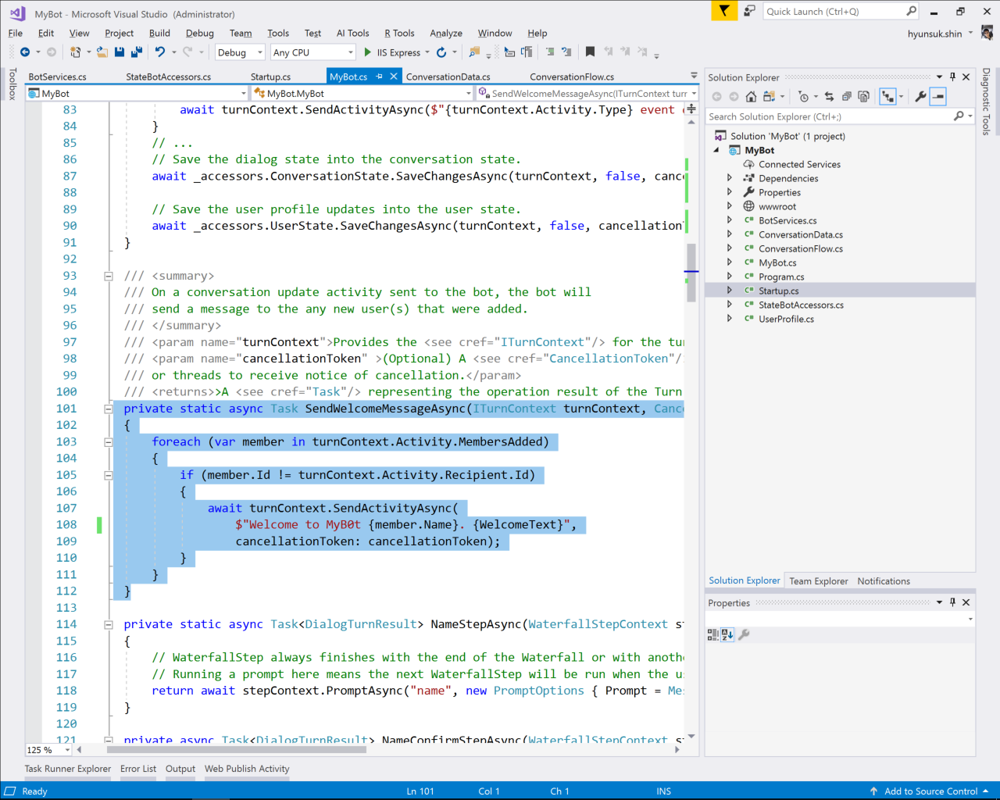

# 6. Welcom Message

Welcome a users and also guide how to start conversation with examples

First impression is the most important to users

Say nice things to a user and help them how to interact with Bot for the first time

## 6.1 Configure

### 6.1.1 Add Welcome Message

```C#
private const string WelcomeText = "I want to understnad you better.";
```

```C#
public async Task OnTurnAsync(ITurnContext turnContext, CancellationToken cancellationToken = default(CancellationToken))
{
    if (turnContext.Activity.Type == ActivityTypes.Message)
    {
        // 4.1.3
        //...
    }
    // 6.1.1
    else if (turnContext.Activity.Type == ActivityTypes.ConversationUpdate)
    {
        // Send a welcome message to the user and tell them what actions they may perform to use this bot
        await SendWelcomeMessageAsync(turnContext, cancellationToken);
    }
    else
    {
        await turnContext.SendActivityAsync($"{turnContext.Activity.Type} event detected", cancellationToken: cancellationToken);
    }
}
```


### 6.1.2 Add SendWelcomeMessageAsync

```C#
private static async Task SendWelcomeMessageAsync(ITurnContext turnContext, CancellationToken cancellationToken)
{
    foreach (var member in turnContext.Activity.MembersAdded)
    {
        if (member.Id != turnContext.Activity.Recipient.Id)
        {
            await turnContext.SendActivityAsync($"Welcome to MyBot {member.Name}. {WelcomeText}", cancellationToken: cancellationToken);
        }
    }
}
```



## 6.2 Test

Use emulator to test the app


---

[Next 07. Integrate with LUIS](./07.IntegrateLUIS.md)