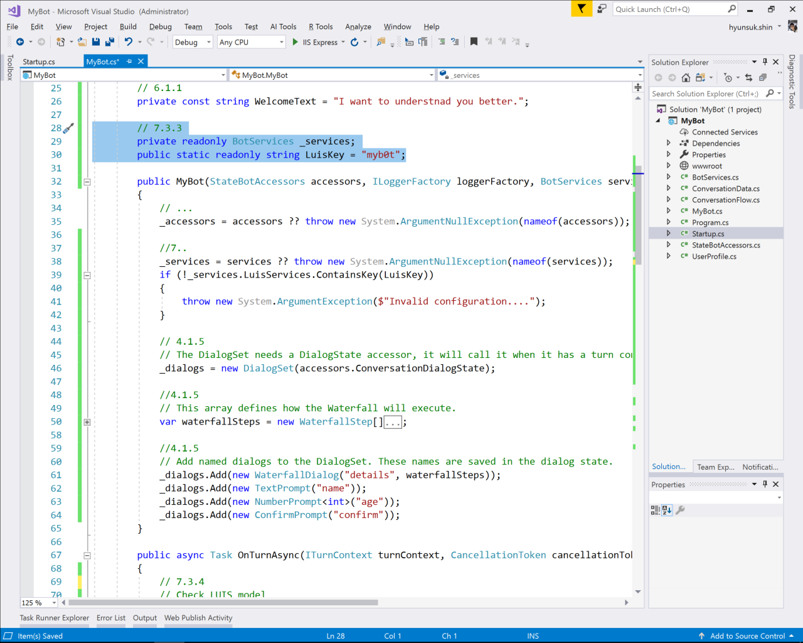

# 7. Using LUIS

## LUIS (Language Understanding Intelligent Service)

### 7.1. Create LUIS app

1. Go to [LUIS.ai](https://www.luis.ai/) from browser

1. Click __Create new app__

1. Give name for example, _MyB0t_ and click __Done__

### 7.2 Create Intents 

1. Click __Create new intent__ button to create new intent 

1. Use __Greeting__ for new intent name and click __Done__

1. Type some samples to train LUIS for example

* hello
* hi
* what's up
* good day
* good morning

### 7.3 Train and Publish

1. Click __Train__ button 

1. Click __Publish__ button

1. Note that __Key 1__ and __Endpoint__, and also get __Application ID__

### 7.3 Update code

1. Add __Microsoft.Bot.Builder.AI.LUIS__ NuGet package

1. Add new class name it __BotServices__.cs and add following code

```C#
using Microsoft.Bot.Builder.AI.Luis;
using Microsoft.Bot.Configuration;
using System;
using System.Collections.Generic;
using System.Linq;
using System.Threading.Tasks;

namespace MyBot
{
    public class BotServices
    {
        // Initializes a new instance of the BotServices class
        public BotServices()
        {
            var app = new LuisApplication("YOUR APP ID", "YOUR ENDPOINT KEY", "YOUR ENDPOINT URL");
            var recognizer = new LuisRecognizer(app);
            this.LuisServices.Add("myb0t", recognizer);
        }

        // Gets the set of LUIS Services used. LuisServices is represented as a dictionary.  
        public Dictionary<string, LuisRecognizer> LuisServices { get; } = new Dictionary<string, LuisRecognizer>();
    }
}
```

1. Add following code at __ConfigureServices__ method in __Startup__.cs

```C#
public void ConfigureServices(IServiceCollection services)
{
    //...

    // 7.3.2
    // Initialize Bot Connected Services clients.
    var connectedServices = new BotServices();
    services.AddSingleton(sp => connectedServices);

    //...
}
```

1. Add following code to __MyBot__.cs

```C#
// 7.3.3
private readonly BotServices _services;
public static readonly string LuisKey = "myb0t";
```



1. Add following code to at __OnTurnAsync__ method in __MyBot__.cs

```C#
public async Task OnTurnAsync(ITurnContext turnContext, CancellationToken cancellationToken = default(CancellationToken))
{
    // 7.3.4
    // Check LUIS model
    var recognizerResult = await _services.LuisServices[LuisKey].RecognizeAsync(turnContext, cancellationToken);
    var topIntent = recognizerResult?.GetTopScoringIntent();
    if (topIntent != null && topIntent.HasValue && topIntent.Value.intent != "None")
    {
        await turnContext.SendActivityAsync($"Hello\nLUIS Top Scoring Intent: {topIntent.Value.intent}, Score: {topIntent.Value.score}\n");
    }
    else if (turnContext.Activity.Type == ActivityTypes.Message)
    {
        // 4.1.3
        //...
    }
}
```


## 7.4 Test

Run the app and test using emulator

> Type few words and sentences for next lab
>
> Try to use:
>
> __test, cancel, start, stop, run, restart__
>
> You will see the Bot asks your name and so on

## 7.5 Review endpoint utterances

1. Go to [LUIS.ai](https://www.luis.ai/) from browser

1. Select your app and click __Review endpoint utterances__ 

1. Categories utterances

1. Select ALL utterances and click __+ Add selected utterances__ button 


1. Click __Train__ and then click __Publish__ when train is done

## 7.6 Deploy Bot to Web App

1. Let's deploy updated bot to Azure Web App

---

[]