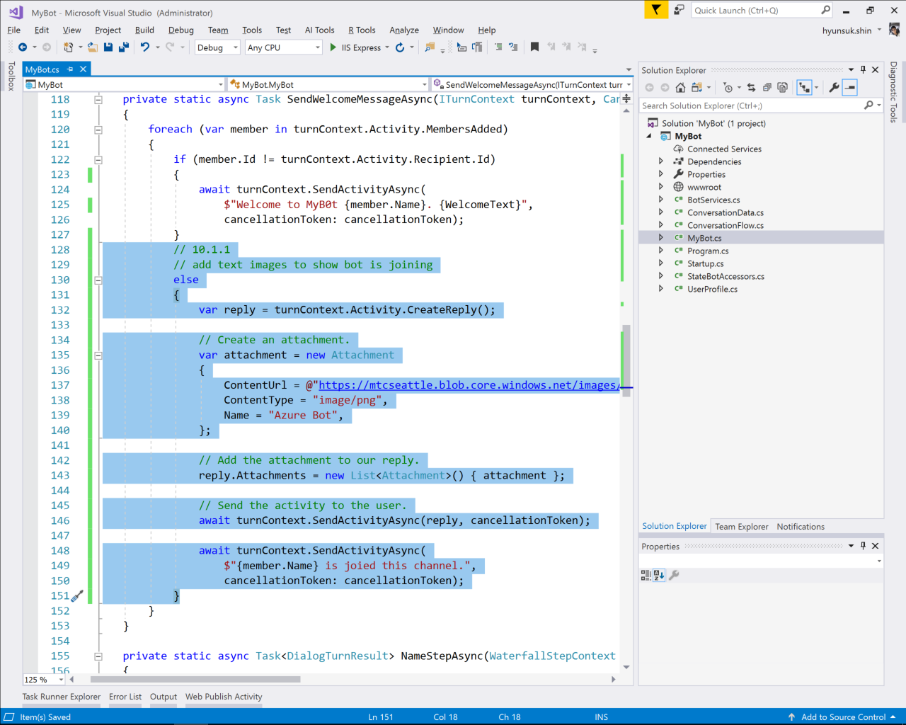
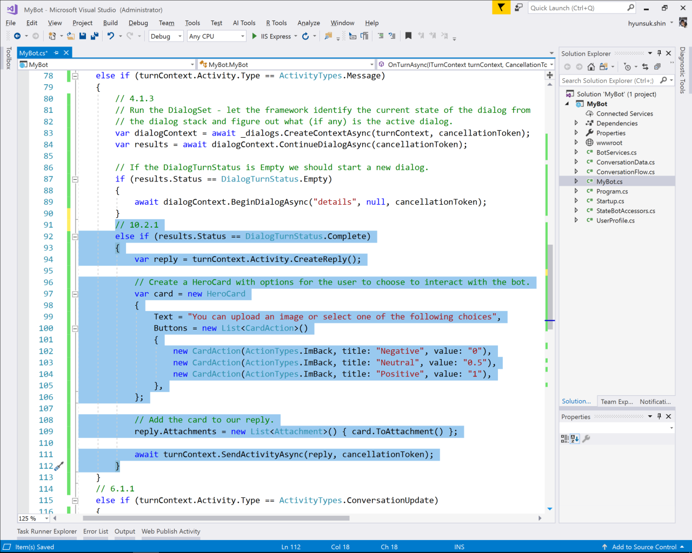

# 10. Add Media to Message

Get a feedback from a user asking how was the bot exeperice was

## 10.1 Show an image to user

### 10.1.1 Send image

Add following code right at __SendWelcomeMessageAsync__ in Bot

```C#
private static async Task SendWelcomeMessageAsync(ITurnContext turnContext, CancellationToken cancellationToken)
{
    foreach (var member in turnContext.Activity.MembersAdded)
    {
        if (member.Id != turnContext.Activity.Recipient.Id)
        {
            await turnContext.SendActivityAsync(
                $"Welcome to MyB0t {member.Name}. {WelcomeText}",
                cancellationToken: cancellationToken);
        }
        // add text images to show bot is joining
        else
        {
            var reply = turnContext.Activity.CreateReply();

            // Create an attachment.
            var attachment = new Attachment
            {
                ContentUrl = @"https://mtcseattle.blob.core.windows.net/images/small Bot Services.png",
                ContentType = "image/png",
                Name = "Azure Bot",
            };

            // Add the attachment to our reply.
            reply.Attachments = new List<Attachment>() { attachment };

            // Send the activity to the user.
            await turnContext.SendActivityAsync(reply, cancellationToken);

            await turnContext.SendActivityAsync(
                $"{member.Name} is joied this channel.",
                cancellationToken: cancellationToken);
        }
    }
}
```


## 10.2 Take a feedback

Add following code to execute when waterfall dialog is competed

```C#
else if (results.Status == DialogTurnStatus.Complete)
{
    var reply = turnContext.Activity.CreateReply();

    // Create a HeroCard with options for the user to choose to interact with the bot.
    var card = new HeroCard
    {
        Text = "You can upload an image or select one of the following choices",
        Buttons = new List<CardAction>()
        {
            new CardAction(ActionTypes.ImBack, title: "Negative", value: "0"),
            new CardAction(ActionTypes.ImBack, title: "Nutural", value: "0.5"),
            new CardAction(ActionTypes.ImBack, title: "Positive", value: "1"),
        },
    };

    // Add the card to our reply.
    reply.Attachments = new List<Attachment>() { card.ToAttachment() };

    await turnContext.SendActivityAsync(reply, cancellationToken);
}
```

